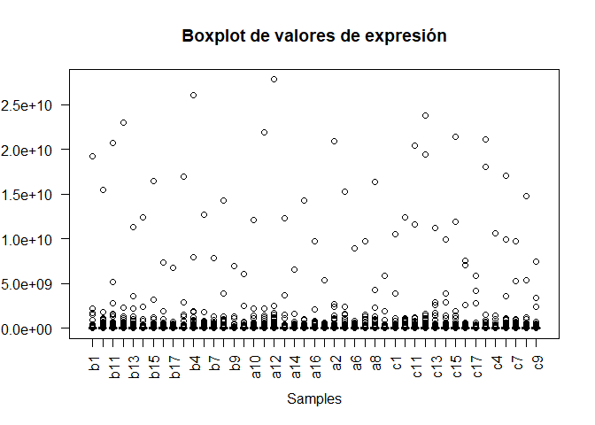
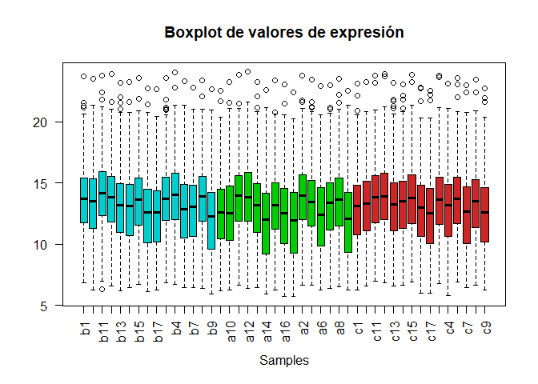

# Presentación y objetivos

Esta PEC trata de planificar y ejecutar una versión simplificada del proceso de análisis de datos ómicos, empleando diversas herramientas y métodos.

## Resumen de objetivos

El trabajo que se pretende desarrollar se resume en:

1.  Seleccionar un dataset de metabolómica desde un repositorio de [github](https://github.com/nutrimetabolomics/metaboData/) o desde el repositorio de [Metabolomics Workbench](https://www.metabolomicsworkbench.org/).

2.  Crear un contenedor del tipo `SummarizedExperiment` que contenga los datos y los metadatos (información acerca del *dataset*, las filas y las columnas).

    La clase `SummarizedExperiment` es una extensión de `ExpressionSet` y muchas aplicaciones o bases de datos (como metabolomicsWorkbench) lo utilizan en vez de usar `ExpressionSet`.

3.  Llevar a cabo una exploración del `dataset` para proporcionar una visión general del mismo.

4.  Elaborar un informe que describa el proceso que realizado, incluyendo la descarga de los datos, la creación del contenedor, la exploración de los datos y la reposición de los datos en github. Este repositorio se llamará: "Clares-Pedrero-Irene-PEC1".

5.  Crear un repositorio de `github` que contenga:

-   El informe
-   El objeto contenedor con los datos y los metadatos en formato binario (.Rda)
-   El código R para la exploración de los datos
-   Los datos en formato texto
-   Los metadatos acerca del *dataset* en un archivo markdown. La dirección (url) del repositorio deberá estar incluida en la última sección del informe de forma clara.

# Introducción

A modo de introducción, hablaremos sobre la clase `SummarizedExperiment`. Esta clase almacena matrices de resultados experimentales, comúnmente obtenidos a partir de secuenciaciones o *microarrays*. Cada objeto de esta clase, almacena informacion de una o más muestras, así como mmetadatos adicionales que descriven tanto observaciones (*features*) como muestras (*phenotypes*).

Es un formato similar al clásico `ExpressionSet`, la principal diferencia radica en que es más flexible en cuanto a información por filas. Esto le hace más adecuado para algunos experimentos como RNA-Seq y ChIp-Seq.

Para trabajar con `SummarizedExperiment` contamos con un paquete propio con el mismo nombre. Este paquete contiene dos clases: `SummarizedExperiment` y `RangedSummarizedExperiment`.

`SummarizedExperiment` es un contenedor tipo matriz en el que las filas representan características de interés (genes, transcritos, exons, etc.) y las columnas representan las muestras o entradas de datos.

Las características representadas en las filas de `SummarizedExperiment` están detalladas en un objeto de tipo `Dataframe` , accesible usando la función `rowData()`. Cada fila del dataframe ofrece informacion de la característica de interés para la fila correspondiente en el `SummarizedExperiment`. Las columnas del `DataFrame` representan differentes atributos de la característica, como ID de genes or transcritos.

# 1. Selección del *dataset* de estudio.

Tras revisar los datos disponibles en el repositorio de github, nos decidimos a emplear los datos contenidos en la carpeta [2024-fobitools-UseCase_1](https://github.com/nutrimetabolomics/metaboData/blob/main/Datasets/2024-fobitools-UseCase_1). Estos datos han sido descargados desde el repositorio de metabolomics Workbench bajo la ID [ST000291](https://www.metabolomicsworkbench.org/data/DRCCMetadata.php?Mode=Study&StudyID=ST000291).

Los datos mostrados corresponden a un experimento diseñado para estudiar cambios metabólcos causados por la concentración en procianidinas presentes en el zumo de grosellas o de manzanas. Se tomaron muestras de sangre y/o orina.

Estos datos constan de 3 archivos diferentes:

1.  `features.csv`. Corresponde a los datos analizados, cada columna corresponde a una muestra biológica (un individuo de estudio o lo que se denomina `sample`) y cada fila corresponde a una lectura de la característica de interés.
2.  `metadata.csv`. Contienen 45 filas que corresponden con las 45 columnas del archivo `features.csv` y dos columnas que describen el nombre de la muestra y el nombre de su grupo.
3.  `metaboliteNames.csv`. Describe el nombre de los metabolitos, tanto su nombre original como su ID en PubChem y en KEGG.

# 2. Construcción de `SummarizedExperiment`.

Podemos construir nuestro objeto `SummarizedExperiment` (SE) descargando los 3 archivos por separado y construyendo el SE *de novo*.

## Importando archivos

Por defecto, un `SummarizedExperiment` puede construirse únicamente con una matriz de datos; aunque trabajar con un `SummarizedExperiment` que no cuente con metadatos de las muestras ni medidas sólo puede hacer análisis básicos por lo que ahora no nos será suficiente.

Comenzamos cargando en el entorno el archivo `features.csv` que es el que contiene las observaciones realizadas para cada una de las muestras. NOTA: Si hicimos una exploración previa de los datos en GitHub, habremos visto que el carácter seprador de los datos en estos archivos es ';', lo que deberemos indicar a la hora de leerlos.

Cargamos los archivos:


``` r
# Importamos el archivo features, que nos servirá de assay

features <- read.csv("features.csv", sep = ";", row.names = 1)
features[1:5, 1:5]  # Visualizamos las primeras entradas de datos
```

```
##               b1     b10      b11    b12     b13
## 443489    941000  757000   612000 858000  185000
## 107754   8300000 6790000 20800000 320000 1290000
## 9543071     1500     890 16200000   1250     968
## 11011465  276000   35700   631000 369000  242000
## 5281160   706000  121000 11600000 164000  424000
```

``` r
dim(features)  # Comprobamos que las dimensiones correspondan con las esperadas
```

```
## [1] 1541   45
```

Con esto, tenemos suficiente para crear un `SummarizedExperiment` rudimentario usando en constructor de Bioconductor. Usamos la matriz de datos `features` bajo el nombre "counts":


``` r
# Creamos el SummarizedExperiment con el constructor

SE_features <- SummarizedExperiment(assays = list(counts = features))
SE_features  # Visualizamos el SE
```

```
## class: SummarizedExperiment 
## dim: 1541 45 
## metadata(0):
## assays(1): counts
## rownames(1541): 443489 107754 ... 53297445 11954209
## rowData names(0):
## colnames(45): b1 b10 ... c8 c9
## colData names(0):
```

Hemos construido un SE que contiene un assay con 1541 entradas de datos para 45 muestras. El nombre de las filas es un código numérico (sólo se muestran las dos primeras y las dos segundas) y las muestras corresponden a un código alfanumérico de una única letra seguida de un número. Por el momento no tenemos ninguna información de fila o de columna.

Si queremos crear un SE más detallado, podemos importar metadatos correspondientes a las muestras y a los metabolitos.

Dado que los archivos tienen un formato similar al archivo que contenía los datos de recuento (`features`), recurrimos a las mismas instrucciones.


``` r
sample_metadata <- read.csv("metadata.csv", sep = ";", row.names = 1)
head(sample_metadata, 5)
```

```
##    ID Treatment
## 1  b1  Baseline
## 2 b10  Baseline
## 3 b11  Baseline
## 4 b12  Baseline
## 5 b13  Baseline
```

``` r
metabolite_metadata <- read.csv("metaboliteNames.csv", sep = ";",
    row.names = 1)
head(metabolite_metadata, 5)
```

```
##                                           names  PubChem   KEGG
## 1                    10-Desacetyltaxuyunnanin C  5460449 C15538
## 2                       10-Hydroxydecanoic acid    74300 C02774
## 3                             10-Oxodecanoate_1 19734156 C02217
## 4 11beta,21-Dihydroxy-5beta-pregnane-3,20-dione 21145110 C05475
## 5                  1,1-Dichloroethylene epoxide   119521 C14857
```

Ya tenemos importados los conjuntos de datos que emplearemos para construir nuestro `SummarizedExperiment` por lo que pasamos a la siguiente fase.

## Creación del `SummarizedExperiment`.

Teniendo ya cargados los archivos, podríamos intentar crear ya por fin nuestro `SummarizedExperiment` empleando el mismo comando constructor y actualizando la información que queremos usar.

### Primer intento

El código mostrado a continuación corresponde a la instrucción que debería usarse para construir el `SummarizedExperiment` a partir de nuestros objetos, sin embargo al correr el código, el terminal lleva a error.


``` r
SE_added <- SummarizedExperiment(assays = list(counts = features),
    colData = sample_metadata, rowData = metabolite_metadata)  # Metadatos de 
# metabolitos

SE_added
```

*NOTA: en las opciones del bloque de código se ha escrito:* `{r, eval=F, echo=T}` *para que se muestre el código pero no corra ni se evalúe durante la exportación.*

El terminal resultante de ejecutar este código nos devuelve el mensaje:

`Error in SummarizedExperiment(assays = list(counts = features), colData = sample_metadata,  : the rownames and colnames of the supplied assay(s) must be NULL or identical to those of the SummarizedExperiment object (or derivative) to construct`

Vemos que algo está pasando en el proceso de cruce de referencias entre la matriz de los datos y los metadatos de muestras y/o metabolitos.

### Observación de los datos

Dado que el error que se nos devuelve indica una falta de correspondencia entre nombres de las columnas y/o filas de `features` con las de los archivos `sample_metadata`y `metabolite_metadata`, procedemos a una comprobación lógica sencilla.


``` r
# Comprobamos si hay correspondencia entre los nombres de
# columnas de features y el nombre de filas de
# sample_metadata

summary(colnames(features) == rownames(sample_metadata))  #Obtenemos la tabla resumen
```

```
##    Mode   FALSE 
## logical      45
```

``` r
# Comprobamos si hay correspondencia entre los nombres de
# filas de features y el nombre de filas de
# metabolite_metadata
summary(rownames(features) == rownames(metabolite_metadata))
```

```
##    Mode   FALSE 
## logical    1541
```

Dada la naturaleza de los `SummarizedExperiment`, el nombre de las columnas contenidas en el archivo con los datos de las muestras (el `assay`, que es `features` en nuestro caso), debería corresponderse con los nombres de las filas de los metadatos de las mismas. Esto se debe a que los metadatos de las muestras dan información sobre las covariables que afectan a las mismas.

Como vemos, esto no ocurre entre nuestros conjuntos de datos por lo que es necesario que nos paremos a observarlos detenidamente.

El primer paso, y quizá lo que debía haberse hecho desde el principio; es observar el nombre de las filas (`row.names`) de los dataset correspondientes a los metadatos:


``` r
# Usamos la instrucción row.names() y visualizamos las
# primeras salidas de datos

head(row.names(sample_metadata), 5)
```

```
## [1] "1" "2" "3" "4" "5"
```

``` r
head(row.names(metabolite_metadata), 5)
```

```
## [1] "1" "2" "3" "4" "5"
```

Como vemos, el nombre de fila (`row name`) de ambos *dataset* es un vector numérico cardinal. Esto es lo que nos estaba llevando a error al emplear el constructor.

Nuestro siguiente paso será arreglar las correspondencias entre *datasets* para hacer coincidir los nombres correspondientes.

### Modificación de `row names`.

#### Modificación de `sample_dataset`.

En primer lugar vamos a tratar al objeto `sample_metadata` para hacer que los nombres de las filas coincidan con los de las columnas de `features`.

Podemos hacerlo de varias formas:

-   Modificar la instrucción de lectura del archivo de modo que al ejecutar `read.csv()` sobre `sample_metadata` se tomen como valores de `rownames` la información contenida en la primera columna(la que corresponde a la **ID**).
-   Sobreescribir los datos ya importados con la información contenida en la primera columna del objeto.
-   Extraer los valores contenidos en la columna ID del dataframe que contiene los metadatos de las muestras en un vector y sustituir los `rownames()` por los valores del vector.

Pasamos a demostrar las 3 formas.


``` r
# METODO 1.  Indicamos que los valores de row.names están
# en la segunda columna cuando importamos el archivo.

sample_metadata_c2 <- read.csv("metadata.csv", sep = ";", row.names = 2)
head(sample_metadata_c2, 5)  # Obtenemos un dataframe con las columnas desordenadas
```

```
##     row.names Treatment
## b1          1  Baseline
## b10         2  Baseline
## b11         3  Baseline
## b12         4  Baseline
## b13         5  Baseline
```

``` r
# MÉTODO 2.  En un nuevo dataframe, indicamos que queremos
# como rownames los valores contenidos en la primera
# columna, que corresponde a las IDs de las muestras.

sample_metadata_mod <- sample_metadata
rownames(sample_metadata_mod) <- sample_metadata[, 1]  # Redefinimos rownames con 
# valores de la columna 1
head(sample_metadata_mod, 5)  # Obtenemos un dataframe en el que el nombre de las filas
```

```
##      ID Treatment
## b1   b1  Baseline
## b10 b10  Baseline
## b11 b11  Baseline
## b12 b12  Baseline
## b13 b13  Baseline
```

``` r
# es el que deseamos, aunque parece que hayamos duplicado
# los datos.

# MÉTODO 3.  Creamos un vector con los datos de la columna
# ID y los establecemos como nuevos valores de row.names()

sample_rownames <- sample_metadata$ID  # Creamos el vector de datos
sample_md_row <- sample_metadata  # Nuevo dataset a partir de sample_metadata
row.names(sample_md_row) <- sample_rownames  # Hacemos la sustitución
head(sample_md_row, 5)  # El nuevo dataframe tiene los nombres de fila cambiados
```

```
##      ID Treatment
## b1   b1  Baseline
## b10 b10  Baseline
## b11 b11  Baseline
## b12 b12  Baseline
## b13 b13  Baseline
```

Es posible comprobar si estos métodos nos ofrecen el resultado esperado haciendo una comparación lógica similar a la empleada anteriormente:


``` r
summary(colnames(features) == rownames(sample_metadata_c2))
```

```
##    Mode    TRUE 
## logical      45
```

``` r
summary(colnames(features) == rownames(sample_metadata_mod))
```

```
##    Mode    TRUE 
## logical      45
```

``` r
summary(colnames(features) == rownames(sample_md_row))
```

```
##    Mode    TRUE 
## logical      45
```

Vemos que cualquiera de los tres métodos es válido para provocar que el nombre de las filas del *dataset* que contiene los metadatos de las muestras coincida con el nombre de las columnas de los datos de las muestras.

Podemos hacer una comparativa entre estas 3 modificaciones para ver que los resultados son muy similares; salvo en el caso de forzar el reconocimiento de `row.names`. En este caso vemos que al modificar las opciones de la instrucción `read.csv()` el orden de las columnas se ha "modificado" y la lista de números que antes era el `row names` ahora parece consolidarse como una nueva covariable llamada "row.names".


``` r
summary(sample_metadata_c2 == sample_metadata_mod)
```

```
##  row.names       Treatment     
##  Mode :logical   Mode:logical  
##  FALSE:45        TRUE:45
```

``` r
summary(sample_metadata_mod == sample_md_row)
```

```
##     ID          Treatment     
##  Mode:logical   Mode:logical  
##  TRUE:45        TRUE:45
```

Como vemos, `sample_metadata_mod` y `sample_md_row` son idénticas entre sí, por lo que nos es indiferente cuál usar. La comparativa entre `sample_metadata_md` y `sample_metadata_mod` nos da error al comparar la primera columna y esto se debe a que, como comentábamos, se ha hecho una reordenación en las columnas. Como no sabemos si esto nos llevará a error a posteriori, decidimos descartar el uso de `sample_metadata_md` en favor de las otras dos alternativas.

Por el momento usaremos `sample_md_row` ya que utiliza el mismo *pipeline* de construcción que usaremos para modificar los metadatos de los metabolitos.

COn esto, ya podríamos volver a intentar construir el `SummarizedExperiment` ya que contamos con el argumento `ColData()`, que no es más que los metadatos de la muestra y que ya corresponden con los datos de `features`. Sin embargo aún nos queda un *dataset* por incorporar al SE.

#### Modificación de `metabolites_dataset`

De forma similar a lo que hicimos en el subapartado anterior, vamos a hacer que los nombres de las filas en `metabolites_dataset` coincidan con los de las filas de `features`.

Para ello seguiremos lo que antes tomábamos como tercer posible método: extraer los valores contenidos en una columna dataframe y usarlos como nuevos `rownames()`.

Redefinimos los `rownames` para que coincidan con los valores de rowname de `features`. Un vistazo a ambos conjuntos de datos evidenciarán que la ID de los metabolitos de `features` corresponde a los que aparecen en la columna `PubChem` de `metabolite_metadata`.


``` r
# Visualizamos las primeras entradas del dataset
head(metabolite_metadata)
```

```
##                                           names  PubChem   KEGG
## 1                    10-Desacetyltaxuyunnanin C  5460449 C15538
## 2                       10-Hydroxydecanoic acid    74300 C02774
## 3                             10-Oxodecanoate_1 19734156 C02217
## 4 11beta,21-Dihydroxy-5beta-pregnane-3,20-dione 21145110 C05475
## 5                  1,1-Dichloroethylene epoxide   119521 C14857
## 6                       11-Hydroxycanthin-6-one   337601 C09212
```

``` r
met_rownames <- metabolite_metadata$PubChem  # Creamos un vector con los valores de la
# columna que luego usaremos como row.name
metabolite_md_row <- metabolite_metadata  # Nuevo dataset a partir de sample_metadata
row.names(metabolite_md_row) <- met_rownames  # Hacemos la sustitución
head(metabolite_md_row, 5)  # El nuevo dataframe tiene los nombres de fila cambiados
```

```
##                                                  names  PubChem   KEGG
## 5460449                     10-Desacetyltaxuyunnanin C  5460449 C15538
## 74300                          10-Hydroxydecanoic acid    74300 C02774
## 19734156                             10-Oxodecanoate_1 19734156 C02217
## 21145110 11beta,21-Dihydroxy-5beta-pregnane-3,20-dione 21145110 C05475
## 119521                    1,1-Dichloroethylene epoxide   119521 C14857
```

Ya hemos redefinido los nombres de las filas del dataset que contiene los metadatos de los metabolitos; pero si hacemos una comprobación rápida veremos que los row.names() de `features` y el nuevo `metabolite_md_row` no coinciden todavía.


``` r
summary(row.names(features) == row.names(metabolite_md_row))
```

```
##    Mode   FALSE 
## logical    1541
```

Esto es porque el nombre que hace referencia a los metabolitos en `metabolite_md_row` no está en el mismo orden en el que se recoge en los datos de las muestras en `features`, lo cual nos supone un nuevo problema.

Aunque es poco elegante, en aras de que haya la mayor coincidencia posible entre los datos, podemos reordenar numéricamente los datos de las muestras y los metadatos de los metabolitos.

Usando en ambos casos el valor del nombre de fila, podemos reordenar las filas de modo que los `row.names()` queden ordenados de menor a mayor. De esta forma estamos forzando la coincidencia entre `rownames` de ambos archivos.

ATENCIÓN: es importante recordar que debemos trabajar con el dataset en el que los nombres de las filas ya han sido modificados, sino, la reordenación no se haría porque los `rownames` son un listado numérico ya ordenado.


``` r
# Creamos un nuevo objeto en el que hayamos reordenado los
# valores en base al nombre de las filas de features.
features_sorted <- features[order(as.numeric(row.names(features))),
    ]
```

```
## Warning in eval(quote(list(...)), env): NAs introducidos por coerción
```

``` r
head(features_sorted, 5)  # Visualizamos
```

```
##          b1      b10      b11      b12      b13      b14      b15      b16
## 16 2.64e+08 3.26e+08 3.19e+08 2.95e+08 2.62e+08 2.84e+08 2.60e+08 2.83e+08
## 21 2.24e+07 2.11e+07 4.91e+07 3.18e+07 1.14e+07 1.20e+07 4.35e+07 1.70e+07
## 25       NA       NA       NA       NA       NA       NA       NA       NA
## 39 1.84e+07 3.18e+07 1.73e+07 2.50e+07 6.83e+06 8.77e+06 2.11e+07 2.02e+06
## 48 2.73e+07 4.03e+07 2.72e+07 3.15e+07 1.34e+07 2.46e+07 2.14e+07 8.78e+06
##         b17       b2       b4       b6       b7       b8       b9       a1
## 16 2.32e+08 3.50e+08 2.80e+08 4.51e+08 2.81e+08 2.59e+08 2.76e+08 4.52e+08
## 21 1.01e+07 1.99e+07 2.96e+07 1.42e+07 1.15e+07 2.56e+07 1.26e+07 2.62e+07
## 25       NA       NA       NA       NA       NA       NA       NA       NA
## 39 9.04e+06 1.18e+07 3.99e+07 6.43e+06 4.43e+06 1.37e+07 9.14e+06 4.16e+06
## 48 6.76e+06 2.62e+07 3.54e+07 1.66e+07 1.36e+07 2.32e+07 1.07e+07 7.89e+06
##         a10      a11      a12      a13      a14      a15      a16      a17
## 16 2.78e+08 2.69e+08 2.77e+08 4.64e+08 2.61e+08 3.06e+08 2.33e+08 2.66e+08
## 21 1.15e+07 3.65e+07 5.48e+07 2.07e+07 8.18e+06 2.72e+07 1.69e+07 1.31e+07
## 25       NA       NA       NA       NA       NA       NA       NA       NA
## 39 5.75e+06 1.31e+07 2.92e+07 5.07e+06 3.43e+06 9.93e+06 3.31e+06 2.64e+06
## 48 1.13e+07 1.92e+07 3.81e+07 1.45e+07 1.13e+07 2.27e+07 1.26e+07 5.49e+06
##          a2       a4       a6       a7       a8       a9       c1      c10
## 16 2.54e+08 2.98e+08 4.10e+08 2.46e+08 2.62e+08 2.64e+08 2.80e+08 2.68e+08
## 21 4.79e+07 2.22e+07 8.97e+06 1.54e+07 2.17e+07 3.45e+07 2.37e+07 2.60e+07
## 25       NA       NA       NA       NA       NA       NA       NA       NA
## 39 1.93e+07 1.22e+07 8.32e+06 7.49e+06 1.95e+07 7.44e+06 6.12e+06 1.09e+07
## 48 3.20e+07 2.22e+07 1.36e+07 1.73e+07 2.04e+07 7.89e+06 1.36e+07 1.63e+07
##         c11      c12      c13      c14      c15      c16      c17       c2
## 16 2.70e+08 3.32e+08 2.94e+08 3.10e+08 2.56e+08 3.05e+08 2.82e+08 2.69e+08
## 21 3.51e+07 4.07e+07 1.27e+07 2.77e+07 2.42e+07 1.68e+07 1.07e+07 3.51e+07
## 25       NA       NA       NA       NA       NA       NA       NA       NA
## 39 1.67e+07 1.89e+07 6.24e+06 1.39e+07 2.27e+07 4.61e+06 2.98e+06 1.71e+07
## 48 2.18e+07 3.75e+07 1.57e+07 1.94e+07 2.45e+07 1.06e+07 6.58e+06 2.91e+07
##          c4       c6       c7       c8       c9
## 16 4.59e+08 2.78e+08 2.55e+08 2.67e+08 2.79e+08
## 21 2.25e+07 2.39e+07 1.15e+07 1.63e+07 2.97e+07
## 25       NA       NA       NA       NA       NA
## 39 8.39e+06 8.80e+06 3.53e+06 7.15e+06 1.04e+07
## 48 1.88e+07 2.45e+07 1.26e+07 2.05e+07 1.22e+07
```

``` r
# Repetimos el proceso con metabolite_md_row
metab_md_sorted <- metabolite_md_row[order(as.numeric(row.names(metabolite_md_row))),
    ]
```

```
## Warning in eval(quote(list(...)), env): NAs introducidos por coerción
```

``` r
head(metab_md_sorted, 5)
```

```
##                                                    names PubChem   KEGG
## 16                   1,8-Diazacyclotetradecane-2,9-dione      16 C04277
## 21                            2-Aceto-2-hydroxybutanoate      21 C00659
## 25 2-Amino-4-oxo-6-(1',2',3'-trihydroxypropyl)-diquin...      25 C05253
## 39                 Dihydro-4,4-dimethyl-2,3-furandione_1      39 C01125
## 48                                      2-Oxoglutaramate      48 C00940
```

Ya hemos reordenado los datos de ambos conjuntos. Al visualizarlos, vemos que en `features_sorted` hay datos NA. Volveremos a ello más adelante.

Comprobamos ya si hay correspondencia entre los nombres de filas de los datos con las muestras y los metadatos de los metabolitos.


``` r
summary(row.names(features_sorted) == row.names(metab_md_sorted))
```

```
##    Mode    TRUE 
## logical    1541
```

El terminal nos indica que los nombres de las filas ya sí son idénticos entre sí.

Con todo esto y una vez modificados los datos como compete, podemos volver a intentar construir el `SummarizedExpression`.

### Construcción del `SummarizedExperiment`.

Ya contamos con nuestros datos procesados, por lo que intentamos de nuevo construir nuestro `SummarizedExpression`.

Usaremos las siguientes opciones en el constructor:

-   `features_sorted` como `assay` para recoger las medidas del experimento.
-   `sample_md_row` como `colData` para dar información de las muestras.
-   `metab_md_sorted` como `rowData` para dar información sobre los metabolitos.

Creamos nuestro `SummarizedExperiment`:


``` r
SE_PEC <- SummarizedExperiment(assays = list(counts = features_sorted),
    colData = sample_md_row, rowData = metab_md_sorted)
SE_PEC
```

```
## class: SummarizedExperiment 
## dim: 1541 45 
## metadata(0):
## assays(1): counts
## rownames(1541): 16 21 ... 92042784 UNKNOWN
## rowData names(3): names PubChem KEGG
## colnames(45): b1 b10 ... c8 c9
## colData names(2): ID Treatment
```

Para nuestro gran regocijo, ya hemos conseguido construir un `SummarizedExperiment` a partir de nuestros archivos .csv descargados en el repositorio.


## Usando `metabolomicsWorkbenchR`

Dado que uno de los objetivos de la PEC era ser capaces de construir un `SummarizedExperiment` a partir de los datos descargados, es lo que hemos hecho en los subapartados anteriores con mayor o menor éxito.

La otra cara de la moneda es que, por fortuna, todos los experimentos recogidos en el repositorio de metabolomics Workbench son accesibles desde el paquete `metabolomicsWorkbenchR` de `Bioconductor`.

Si instalamos y cargamos el paquete `metabolomicsWorkbenchR`, podemos importar diferentes `SummarizedExperiment` e interrogar sobre los mismos haciendo instrucciones del tipo `do_query()`.


``` r
# Instucciones de instalación de paquetes en caso de ser
# necesario, lo hacemos código no ejecutable para este
# bloque

if (!requireNamespace("BiocManager", quietly = TRUE)) install.packages("BiocManager")

BiocManager::install(c("SummarizedExperiment", "metabolomicsWorkbenchR"))
```

Si ya tenemos cargados los paquetes necesarios, vemos que con una simple instrucción podemos acceder al `SummarizedExperiment` que se corresponde al estudio ST000291 de Metabolomics Workbench a través de R. Es una instrucción más simple; pero que tarda consustancialmente más en ejecutarse.


``` r
library("metabolomicsWorkbenchR")
SE_metWB = do_query(context = "study", input_item = "study_id",
    input_value = "ST000291", output_item = "SummarizedExperiment"  # or 'DatasetExperiment'
)

SE_metWB
```

```
## $AN000464
## class: SummarizedExperiment 
## dim: 1786 45 
## metadata(8): data_source study_id ... description subject_type
## assays(1): ''
## rownames(1786): ME104202 ME104203 ... ME105898 ME105899
## rowData names(3): metabolite_name metabolite_id refmet_name
## colnames(45): a1 a10 ... c8 c9
## colData names(6): local_sample_id study_id ... raw_data Treatment_
## 
## $AN000465
## class: SummarizedExperiment 
## dim: 747 45 
## metadata(8): data_source study_id ... description subject_type
## assays(1): ''
## rownames(747): ME105925 ME105926 ... ME106646 ME106647
## rowData names(3): metabolite_name metabolite_id refmet_name
## colnames(45): a1 a10 ... c8 c9
## colData names(6): local_sample_id study_id ... raw_data Treatment_
```

``` r
head(assay(SE_metWB), 3)
```

```
## $AN000464
## class: SummarizedExperiment 
## dim: 1786 45 
## metadata(8): data_source study_id ... description subject_type
## assays(1): ''
## rownames(1786): ME104202 ME104203 ... ME105898 ME105899
## rowData names(3): metabolite_name metabolite_id refmet_name
## colnames(45): a1 a10 ... c8 c9
## colData names(6): local_sample_id study_id ... raw_data Treatment_
## 
## $AN000465
## class: SummarizedExperiment 
## dim: 747 45 
## metadata(8): data_source study_id ... description subject_type
## assays(1): ''
## rownames(747): ME105925 ME105926 ... ME106646 ME106647
## rowData names(3): metabolite_name metabolite_id refmet_name
## colnames(45): a1 a10 ... c8 c9
## colData names(6): local_sample_id study_id ... raw_data Treatment_
```

Como resultado, obtendremos también un `SummarizedExperiment` de características medianamente similares al nuestro; aunque basta con una simple visualización de éste para darnos cuenta que es mucho más completo. Esto se debe, seguramente, a que este `SummarizedExperiment` cuenta con más información de la que tenemos nosotros en nuestos dos archivos, lo que se ve a simple vista al observar la salida `colData names`, que es de 2 en nuestro caso y de 6 en el de `metabolomicsWorkbenchR`.

En cualquier caso, ya tenemos nuestro contenedor y pasaremos a trabajar con él.

# 3. Análisis exploratorio de los datos

Una vez contamos con nuestro contenedor `SummarizedExperiment` ya creado, procedemos a hacer un análisis exploratorio de los datos similar al que hemos visto en algunos casos de estudio.

## Estructura y valores `NAs`.

El análisis más sencillo es el de la estructura de los datos de los que disponemos y la observación de los datos.

Ya conocemos las dimensiones de los dataset que componen el contenedor; pero no está de más recordarlo. A modo de exploración anectdótica vemos las dimensiones de cada componente y datos sobre alguna covariable:


``` r
dim(SE_PEC)  # Dimensiones del SummarizedExperiment
```

```
## [1] 1541   45
```

``` r
dim(assay(SE_PEC))  # Dimensiones de la matriz de datos
```

```
## [1] 1541   45
```

``` r
dim(rowData(SE_PEC))
```

```
## [1] 1541    3
```

``` r
dim(colData(SE_PEC))
```

```
## [1] 45  2
```

``` r
unique(SE_PEC$Treatment)  # Tratamientos únicos.
```

```
## [1] "Baseline"  "Apple"     "Cranberry"
```

``` r
print(paste("Tendremos", sum(SE_PEC$Treatment == "Baseline"),
    "muestras que no han sido tratadas,", sum(SE_PEC$Treatment ==
        "Apple"), "con tratamiento de zumo de manzana y", sum(SE_PEC$Treatment ==
        "Cranberry"), "con zumo de grosellas"))
```

```
## [1] "Tendremos 15 muestras que no han sido tratadas, 15 con tratamiento de zumo de manzana y 15 con zumo de grosellas"
```

Tenemos un objeto con 1541 entradas datos correspondientes a 45 muestras diferentes de las que se han tomado lecturas para 1541 metabolitos. Las muestras se subagrupan en 3 grupos según el tratamiento que hayan recibido.

Además, si recordamos lo visto anteriormente en el subapartado en el que ordenamos los metadatos y las muestras, observamos que algunas filas contenían valores NA. Podemos comprobar esto con una simple instrucción.


``` r
table(summary(is.na(assay(SE_PEC))))
```

```
## 
## FALSE:1359      Mode :logical   TRUE :182       
##              45              45              45
```

Como vemos, hay 182 instancias en las que se reconoce que hay valores NA en los datos. Aunque por el momento no estamos demasiado versados en el uso de `SummarizedExperiments`, sabemos por experiencias anteriores que la presencia de NAs en los datos tiende a emborronar o impedir en cierta forma cualquier intento de análisis de los datos.

Dado que no sabemos si esto va a cumplirse en el caso de contenedores `SummarizedExperiments`, decidimos suprimirlos del nuestro para evitar sorpresas. Tomamos esta decisión porque podemos suponer que todo dato no registrado se debe a que la lectura del metabolito fue errónea por algún fallo de metodología o que directamente no era un metabolito de interés, por lo que su omisión no debería afectar a nuestro análisis.

Para eliminar las filas que contengan NAs, podemos hacer una búsqueda dentro del `SummarizedExperiment`. Crearemos un vector con el índice de las filas que **no** contengan NAs y haremos un *subsetting* de nuestro NE para obtener los datos "completos".

Crearemos nuestro vector seleccionando el inverso (`!`) del análisis que detecta dónde se localizan lecturas NA (`is.na`).


``` r
# Extraemos un vector que contenga índices de filas
# completas
vector_full <- which(!(is.na(assay(SE_PEC)[[1]])))
length(vector_full)  # Visualizamos la cantidad de filas
```

```
## [1] 1359
```

``` r
# Hacemos el subsetting de nuestro SE
SE_PEC_full <- SE_PEC[c(vector_full), ]
SE_PEC_full  # Visualizamos el resumen del SE
```

```
## class: SummarizedExperiment 
## dim: 1359 45 
## metadata(0):
## assays(1): counts
## rownames(1359): 16 21 ... 92042784 UNKNOWN
## rowData names(3): names PubChem KEGG
## colnames(45): b1 b10 ... c8 c9
## colData names(2): ID Treatment
```

``` r
# Podemos visualizar la matriz de datos para ver si nos
# hemos librado de los NA

assay(SE_PEC_full)[1:10, 1:5]
```

```
##          b1      b10      b11      b12      b13
## 16 2.64e+08 3.26e+08 3.19e+08 2.95e+08 2.62e+08
## 21 2.24e+07 2.11e+07 4.91e+07 3.18e+07 1.14e+07
## 39 1.84e+07 3.18e+07 1.73e+07 2.50e+07 6.83e+06
## 48 2.73e+07 4.03e+07 2.72e+07 3.15e+07 1.34e+07
## 49 1.93e+07 1.17e+07 1.89e+07 2.49e+07 2.67e+06
## 51 1.41e+08 9.52e+07 1.69e+08 5.74e+07 1.07e+08
## 58 4.16e+07 3.53e+07 1.00e+08 4.98e+07 2.77e+07
## 70 5.10e+06 8.09e+06 6.74e+06 1.40e+06 2.77e+06
## 71 9.10e+05 6.96e+05 1.20e+06 1.03e+06 7.23e+05
## 86 5.38e+06 8.10e+06 7.41e+06 5.04e+06 3.17e+06
```

Ya tenemos un `SummarizedExperiment` sin valores NA que puedan alterar de cualquier forma nuestros análisis. Podemos pasar a estudios más complejos.

## Análisis univariante de los datos

Es la forma más sencilla de análisis de nuestros datos, ya que estudia las variables de forma independiente. Examina las variables para explorar propuedades estadísticas y estructurales como son dispersión de datos, valores atípicos (*outliers*) y su tendencia central.

Vamos a hacernos una idea de los valores estadísticos de las muestras gracias a De un vistazo rápido, podemos hacernos una idea de las estadísticas de cada muestra usando la función `summary()`.


``` r
head(summary(assay(SE_PEC_full)[, 1:5]))
```

```
##        b1                 b10                 b11           
##  Min.   :0.000e+00   Min.   :0.000e+00   Min.   :0.000e+00  
##  1st Qu.:1.235e+05   1st Qu.:8.145e+04   1st Qu.:2.240e+05  
##  Median :9.100e+05   Median :7.200e+05   Median :1.450e+06  
##  Mean   :3.245e+07   Mean   :2.800e+07   Mean   :4.107e+07  
##  3rd Qu.:4.980e+06   3rd Qu.:4.500e+06   3rd Qu.:8.050e+06  
##  Max.   :1.920e+10   Max.   :1.550e+10   Max.   :2.070e+10  
##       b12                 b13           
##  Min.   :0.000e+00   Min.   :0.000e+00  
##  1st Qu.:1.390e+05   1st Qu.:5.810e+04  
##  Median :1.010e+06   Median :5.380e+05  
##  Mean   :3.606e+07   Mean   :2.452e+07  
##  3rd Qu.:5.545e+06   3rd Qu.:3.095e+06  
##  Max.   :2.300e+10   Max.   :1.130e+10
```

Simplemente con el resumen estadístico de las muestras vemos que se evidencia una clara asimetría en ellos: los mínimos están en 0 y los máximos adquieren valores del orden e+10.

Para facilitar la comprensión del análisis univariante podemos emplear gráficos como **boxplots** o **histogramas**.

Dada la naturaleza de nuestros datos (n=45), decidimos usar los boxplots como herramienta de representación gráfica del análisis univariante. Querer generar 45 histogramas diferentes es no sólo ambicioso sino muy demandante y los límites de la representación se resienten.


``` r
# Creamos un vector con los colores que usaremos luego en
# el boxplot
color <- c(rep("cyan3", 15), rep("green3", 15), rep("firebrick3",
    15))

boxplot(assay(SE_PEC_full), las = 2, col = color, main = "Boxplot de valores de expresión",
    xlab = "Samples")
```

<!-- -->

El boxplot de los datos evidencia una clara asimetría en los mismos. Esto sugiere que quizá sea necesario hacer algún tratamiento a los mismos para tratar con ellos.

Un posible tratamiento de los datos puede ser una transformación logarítmica:


``` r
boxplot(log(assay(SE_PEC_full)), las = 2, col = color, main = "Boxplot de valores de expresión",
    xlab = "Samples")
```

```
## Warning in bplt(at[i], wid = width[i], stats = z$stats[, i], out =
## z$out[z$group == : Outlier (-Inf) in boxplot 1 is not drawn
```

```
## Warning in bplt(at[i], wid = width[i], stats = z$stats[, i], out =
## z$out[z$group == : Outlier (-Inf) in boxplot 2 is not drawn
```

```
## Warning in bplt(at[i], wid = width[i], stats = z$stats[, i], out =
## z$out[z$group == : Outlier (-Inf) in boxplot 3 is not drawn
```

```
## Warning in bplt(at[i], wid = width[i], stats = z$stats[, i], out =
## z$out[z$group == : Outlier (-Inf) in boxplot 4 is not drawn
```

```
## Warning in bplt(at[i], wid = width[i], stats = z$stats[, i], out =
## z$out[z$group == : Outlier (-Inf) in boxplot 5 is not drawn
```

```
## Warning in bplt(at[i], wid = width[i], stats = z$stats[, i], out =
## z$out[z$group == : Outlier (-Inf) in boxplot 6 is not drawn
```

```
## Warning in bplt(at[i], wid = width[i], stats = z$stats[, i], out =
## z$out[z$group == : Outlier (-Inf) in boxplot 7 is not drawn
```

```
## Warning in bplt(at[i], wid = width[i], stats = z$stats[, i], out =
## z$out[z$group == : Outlier (-Inf) in boxplot 8 is not drawn
```

```
## Warning in bplt(at[i], wid = width[i], stats = z$stats[, i], out =
## z$out[z$group == : Outlier (-Inf) in boxplot 9 is not drawn
```

```
## Warning in bplt(at[i], wid = width[i], stats = z$stats[, i], out =
## z$out[z$group == : Outlier (-Inf) in boxplot 10 is not drawn
```

```
## Warning in bplt(at[i], wid = width[i], stats = z$stats[, i], out =
## z$out[z$group == : Outlier (-Inf) in boxplot 11 is not drawn
```

```
## Warning in bplt(at[i], wid = width[i], stats = z$stats[, i], out =
## z$out[z$group == : Outlier (-Inf) in boxplot 12 is not drawn
```

```
## Warning in bplt(at[i], wid = width[i], stats = z$stats[, i], out =
## z$out[z$group == : Outlier (-Inf) in boxplot 13 is not drawn
```

```
## Warning in bplt(at[i], wid = width[i], stats = z$stats[, i], out =
## z$out[z$group == : Outlier (-Inf) in boxplot 14 is not drawn
```

```
## Warning in bplt(at[i], wid = width[i], stats = z$stats[, i], out =
## z$out[z$group == : Outlier (-Inf) in boxplot 15 is not drawn
```

```
## Warning in bplt(at[i], wid = width[i], stats = z$stats[, i], out =
## z$out[z$group == : Outlier (-Inf) in boxplot 16 is not drawn
```

```
## Warning in bplt(at[i], wid = width[i], stats = z$stats[, i], out =
## z$out[z$group == : Outlier (-Inf) in boxplot 17 is not drawn
```

```
## Warning in bplt(at[i], wid = width[i], stats = z$stats[, i], out =
## z$out[z$group == : Outlier (-Inf) in boxplot 18 is not drawn
```

```
## Warning in bplt(at[i], wid = width[i], stats = z$stats[, i], out =
## z$out[z$group == : Outlier (-Inf) in boxplot 19 is not drawn
```

```
## Warning in bplt(at[i], wid = width[i], stats = z$stats[, i], out =
## z$out[z$group == : Outlier (-Inf) in boxplot 20 is not drawn
```

```
## Warning in bplt(at[i], wid = width[i], stats = z$stats[, i], out =
## z$out[z$group == : Outlier (-Inf) in boxplot 21 is not drawn
```

```
## Warning in bplt(at[i], wid = width[i], stats = z$stats[, i], out =
## z$out[z$group == : Outlier (-Inf) in boxplot 22 is not drawn
```

```
## Warning in bplt(at[i], wid = width[i], stats = z$stats[, i], out =
## z$out[z$group == : Outlier (-Inf) in boxplot 23 is not drawn
```

```
## Warning in bplt(at[i], wid = width[i], stats = z$stats[, i], out =
## z$out[z$group == : Outlier (-Inf) in boxplot 24 is not drawn
```

```
## Warning in bplt(at[i], wid = width[i], stats = z$stats[, i], out =
## z$out[z$group == : Outlier (-Inf) in boxplot 25 is not drawn
```

```
## Warning in bplt(at[i], wid = width[i], stats = z$stats[, i], out =
## z$out[z$group == : Outlier (-Inf) in boxplot 26 is not drawn
```

```
## Warning in bplt(at[i], wid = width[i], stats = z$stats[, i], out =
## z$out[z$group == : Outlier (-Inf) in boxplot 27 is not drawn
```

```
## Warning in bplt(at[i], wid = width[i], stats = z$stats[, i], out =
## z$out[z$group == : Outlier (-Inf) in boxplot 28 is not drawn
```

```
## Warning in bplt(at[i], wid = width[i], stats = z$stats[, i], out =
## z$out[z$group == : Outlier (-Inf) in boxplot 29 is not drawn
```

```
## Warning in bplt(at[i], wid = width[i], stats = z$stats[, i], out =
## z$out[z$group == : Outlier (-Inf) in boxplot 30 is not drawn
```

```
## Warning in bplt(at[i], wid = width[i], stats = z$stats[, i], out =
## z$out[z$group == : Outlier (-Inf) in boxplot 31 is not drawn
```

```
## Warning in bplt(at[i], wid = width[i], stats = z$stats[, i], out =
## z$out[z$group == : Outlier (-Inf) in boxplot 32 is not drawn
```

```
## Warning in bplt(at[i], wid = width[i], stats = z$stats[, i], out =
## z$out[z$group == : Outlier (-Inf) in boxplot 33 is not drawn
```

```
## Warning in bplt(at[i], wid = width[i], stats = z$stats[, i], out =
## z$out[z$group == : Outlier (-Inf) in boxplot 34 is not drawn
```

```
## Warning in bplt(at[i], wid = width[i], stats = z$stats[, i], out =
## z$out[z$group == : Outlier (-Inf) in boxplot 35 is not drawn
```

```
## Warning in bplt(at[i], wid = width[i], stats = z$stats[, i], out =
## z$out[z$group == : Outlier (-Inf) in boxplot 36 is not drawn
```

```
## Warning in bplt(at[i], wid = width[i], stats = z$stats[, i], out =
## z$out[z$group == : Outlier (-Inf) in boxplot 37 is not drawn
```

```
## Warning in bplt(at[i], wid = width[i], stats = z$stats[, i], out =
## z$out[z$group == : Outlier (-Inf) in boxplot 38 is not drawn
```

```
## Warning in bplt(at[i], wid = width[i], stats = z$stats[, i], out =
## z$out[z$group == : Outlier (-Inf) in boxplot 39 is not drawn
```

```
## Warning in bplt(at[i], wid = width[i], stats = z$stats[, i], out =
## z$out[z$group == : Outlier (-Inf) in boxplot 40 is not drawn
```

```
## Warning in bplt(at[i], wid = width[i], stats = z$stats[, i], out =
## z$out[z$group == : Outlier (-Inf) in boxplot 41 is not drawn
```

```
## Warning in bplt(at[i], wid = width[i], stats = z$stats[, i], out =
## z$out[z$group == : Outlier (-Inf) in boxplot 42 is not drawn
```

```
## Warning in bplt(at[i], wid = width[i], stats = z$stats[, i], out =
## z$out[z$group == : Outlier (-Inf) in boxplot 43 is not drawn
```

```
## Warning in bplt(at[i], wid = width[i], stats = z$stats[, i], out =
## z$out[z$group == : Outlier (-Inf) in boxplot 44 is not drawn
```

```
## Warning in bplt(at[i], wid = width[i], stats = z$stats[, i], out =
## z$out[z$group == : Outlier (-Inf) in boxplot 45 is not drawn
```

<!-- -->

Vemos que la transformación logarítmica de los datos es necesaria y se nos muestra que los datos son bastante comparables entre sí. La presencia de outliers es clara y no se resuelve ni tan siquiera con la transformación logarítmica pero por el momento no es importante.

Podríamos recurrir al resumen estadístico de las muestras con `summary()`.


``` r
SE_log <- log(assay(SE_PEC_full))
head(summary(SE_log[, 1:5]))
```

```
##        b1             b10             b11             b12       
##  Min.   : -Inf   Min.   : -Inf   Min.   : -Inf   Min.   : -Inf  
##  1st Qu.:11.72   1st Qu.:11.31   1st Qu.:12.32   1st Qu.:11.84  
##  Median :13.72   Median :13.49   Median :14.19   Median :13.83  
##  Mean   : -Inf   Mean   : -Inf   Mean   : -Inf   Mean   : -Inf  
##  3rd Qu.:15.42   3rd Qu.:15.32   3rd Qu.:15.90   3rd Qu.:15.53  
##  Max.   :23.68   Max.   :23.46   Max.   :23.75   Max.   :23.86  
##       b13       
##  Min.   : -Inf  
##  1st Qu.:10.97  
##  Median :13.20  
##  Mean   : -Inf  
##  3rd Qu.:14.95  
##  Max.   :23.15
```

Estos valores estadísticos tras el tratamiento de los datos es más "razonable" si tenemos en cuenta que no están tan dispersos. Esto probablemente se traduzca en un análisis posterior más robusto-

Al visualizar la estructura de los datos y sus estadísticas, se pone en evidencia que nuestros datos no se encontraban pre-procesados y que este proceso puede llegar a resultar fundamental para llevar a cabo un buen análisis posterior de los datos.

El principal inconveniente de estos análisis es que sólo nos están dando información a nivel de la muestra, es decir, resulta casi un informe cualitativo de los datos.

Si queremos intentar sacar conclusiones de nuestros datos, requerimos de un análisis más exhaustivo.
